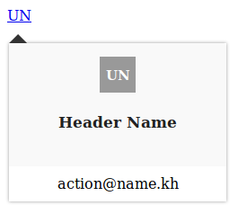

# Kh-Popover

[](https://www.npmjs.com/package/kh-popover)  [](https://www.npmjs.com/package/kh-popover) [](https://www.npmjs.com/package/kh-popover) 

### Description

Popover build for vuejs framework.<br>
This packages still in dev mode. This Popover specialy made for user/account display information

### Getting Started

This package help you create Popover/Tooltip with a pre-squelette and give you the possibility to set yours and dynamic positions.

You can view this package on both **npm** and **yarn**

**kh-popover** Package links : <br>
- <a href="https://www.npmjs.com/package/kh-popover" target="_blank">npm</a>
- <a href="https://yarnpkg.com/en/package/kh-popover" target="_blank">yarn</a>

### Installing

npm installation : 

```
npm i kh-popover
```

yarn installation : 

```
yarn add kh-popover
```

### Usage



```html
<template>
	<kh-popover />
</template>
```

```javascript

require('kh-popover/dist/kh-popover.css');
import khPopover from 'kh-popover';

export default {
	components:{
		'kh-popover':khPopover
	}
}
```

### Attributes

| attribute | Type | description | default value | options |
|---|---|---|---|---|
| :user 		| Object  | this object hold user data 		| {} | { id, name, photo, avatar, email } |
| :position 	| String  | define popover position 		| 'auto'	| 'auto','top','bottom' |
| :trigger 	| String  | accept two options 				| 'hover'	| 'hover','click' 	  	|
| :name 		| Boolean | to display given user's name 	| false		|  --					|
| :icon 		| Boolean | to display avatar 				| true		|  --					|

### Slots

| Slot name | Description |
|----|----|
| avatar 			| For `Popover avatar` located |
| content 			| For `Popover core` _( includes both [ **content_info**, **content_actions** ])_ |
| content_info 		| For `Popover header` |
| content_actions 	| For `Popover footer` |

### Next

- **Demo** : We will publish a demo asap
- **Testing** : We will add Unit Test